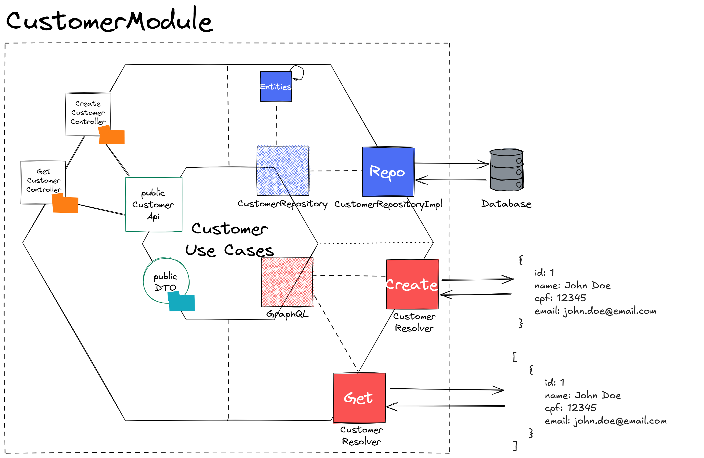

# Hexagonal Architecture

“Permitir que uma aplicação seja igualmente conduzida por usuários, programas, testes automatizados, scripts em lote e que possa ser desenvolvida e testada isoladamente de seus dispositivos de execução e banco de dados finais.” (Alistair Cockburn, 2005).

### 👍 Vantagens da Arquitetura Hexagonal:
- Desacoplamento da lógica de negócios
- Facilidade de testes
- Flexibilidade e Extensibilidade
- Manutenção e Evolução
- Organização do código

### 👎 Desvantagens da Arquitetura Hexagonal:
- Curva de Aprendizado
- Maior complexidade inicial
- Mais código boilerplate
- Dificuldade na integração com frameworks tradicionais

### ✅ Quando usar?
- Projetos de médio a grande porte, onde a manutenção, escalabilidade e testabilidade são cruciais.
- Sistemas que precisam ser resilientes a mudanças de tecnologias externas (ex.: mudança de banco de dados ou API 
  externa).
- Projetos onde o foco no domínio e na lógica de negócio é primordial.
- Cenários onde a testabilidade é um requisito essencial.

### ❌ Quando evitar?
- Projetos pequenos ou simples, onde o overhead inicial não compensa os benefícios.
- Times com pouca experiência em arquitetura hexagonal ou sem tempo para treinamento adequado.

## Projeto Event App

##### Modelo
 - Customer: Representação do cliente no sistema 
 - Partner: Representa quem vai criar um evento (uma casa de show, por exemplo)
 - Event: Representa os eventos
 - Ticket: Representa a lista de tickets que será disponibilizado para cada evento

### Diagrama

## GraphQL

- http://localhost:8080/graphiql?path=/graphql

### Customer

    mutation {
      createCustomer(input: {name: "joe", cpf: "123.332.229-87", email: "joe@email.com"}) {
        id
      }
    }
  
    query {
      customer: customerOfId(id: "14641f16-4cce-4e56-9bb0-a55873ef3a79") {
        name
      }
    }

### Partner

    mutation {
      createPartner(input: {name: "Johnny", cnpj: "12.231.123/0001-11", email: "johnny@email.com"}) {
        id
      }
    }

    query {
      partner: partnerOfId(id: "24721be4-eab2-4878-b9bb-ef6cb522b230") {
        id
      }
    }

### Event

    mutation {
      createEvent(input: {name: "Disney 2.0", date: "2025-01-01", totalSpots: 1, partnerId:"24721be4-eab2-4878-b9bb-ef6cb522b230"}) {
        id
      }
    }

### Subscribe Customer to Event

    mutation {
      subscribeCustomerToEvent(input: {customerId: "14641f16-4cce-4e56-9bb0-a55873ef3a79", eventId: "e9a8b96e-0137-4715-a896-c352cdd2e17e"}) {
        eventId
      }
    }