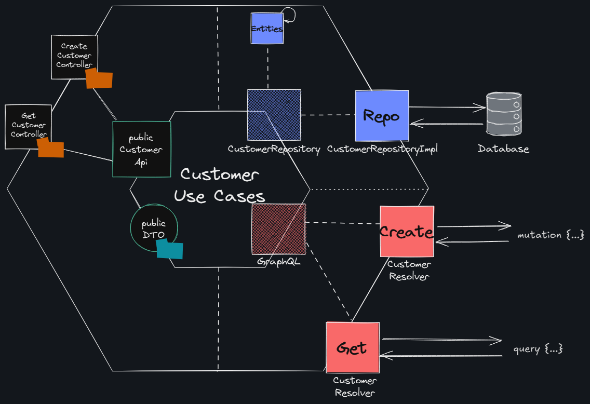

# Hexagonal Architecture

“Allow an application to be equally be driven by users, programs, automated, tests, batch scripts, and to be developed and tested in isolation from its eventual run-time devices and database” (Alistair Cockburn, 2005).

### Vantagens da Arquitetura Hexagonal:
- Independência de Tecnologias: Permite trocar frameworks e ferramentas sem impactar a lógica central.
- Facilidade de Testes: Facilita a criação de testes unitários e de integração devido à separação clara entre 
  domínios e dependências externas.
- Manutenibilidade: Código mais organizado e modular, reduzindo o acoplamento.
- Flexibilidade: Adaptável a mudanças de requisitos, já que os adaptadores externos podem ser facilmente substituídos.
- Escalabilidade: Suporte a múltiplos tipos de interface (APIs, CLI, etc.) sem modificar o núcleo da aplicação.

### Desvantagens da Arquitetura Hexagonal:
- Complexidade Inicial: Exige mais esforço para entender e implementar corretamente, especialmente para equipes 
inexperientes.
- Sobrecarga de Abstrações: Pode introduzir camadas desnecessárias, tornando o desenvolvimento mais lento em projetos 
  pequenos.
- Maior Tempo de Desenvolvimento: Requer mais planejamento e design para separar responsabilidades adequadamente.
- Overengineering: Não é ideal para aplicações simples ou com ciclo de vida curto.

### Quando usar?
- Projetos de médio a grande porte, onde a manutenção, escalabilidade e testabilidade são cruciais.
- Sistemas que precisam ser resilientes a mudanças de tecnologias externas (ex.: mudança de banco de dados ou API 
  externa).
- Projetos onde o foco no domínio e na lógica de negócio é primordial.
- Cenários onde a testabilidade é um requisito essencial.

### Quando evitar?
- Projetos pequenos ou simples, onde o overhead inicial não compensa os benefícios.
- Times com pouca experiência em arquitetura hexagonal ou sem tempo para treinamento adequado.

## Projeto Event App

##### Modelo
 - Customer: Representação do cliente no sistema 
 - Partner: Representa quem vai criar um evento (uma casa de show, por exemplo)
 - Event: Representa os eventos
 - Ticket: Representa a lista de tickets que será disponibilizado para cada evento

### Diagrama

## GraphQL

- http://localhost:8080/graphiql?path=/graphql

### Customer

    mutation {
      createCustomer(input: {name: "joe", cpf: "123.332.229-87", email: "joe@email.com"}) {
        id
      }
    }
  
    query {
      customer: customerOfId(id: "14641f16-4cce-4e56-9bb0-a55873ef3a79") {
        name
      }
    }

### Partner

    mutation {
      createPartner(input: {name: "Johnny", cnpj: "12.231.123/0001-11", email: "johnny@email.com"}) {
        id
      }
    }

    query {
      partner: partnerOfId(id: "24721be4-eab2-4878-b9bb-ef6cb522b230") {
        id
      }
    }

### Event

    mutation {
      createEvent(input: {name: "Disney 2.0", date: "2025-01-01", totalSpots: 1, partnerId:"24721be4-eab2-4878-b9bb-ef6cb522b230"}) {
        id
      }
    }

### Subscribe Customer to Event

    mutation {
      subscribeCustomerToEvent(input: {customerId: "14641f16-4cce-4e56-9bb0-a55873ef3a79", eventId: "e9a8b96e-0137-4715-a896-c352cdd2e17e"}) {
        eventId
      }
    }